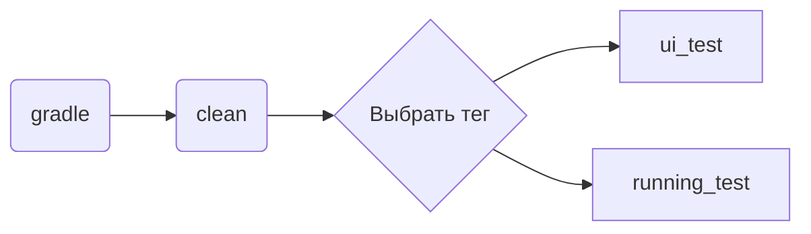
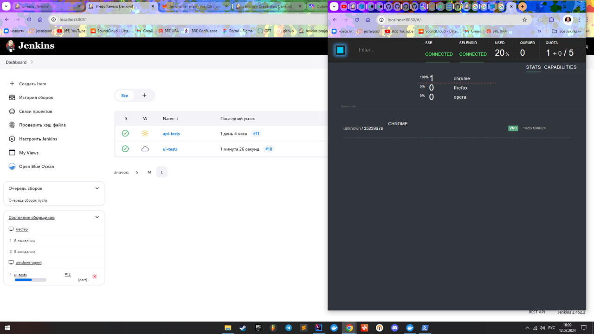
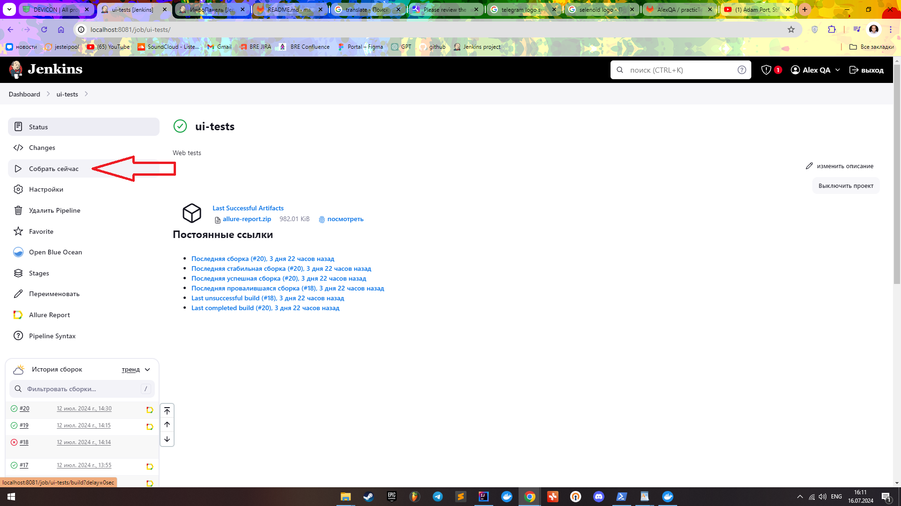
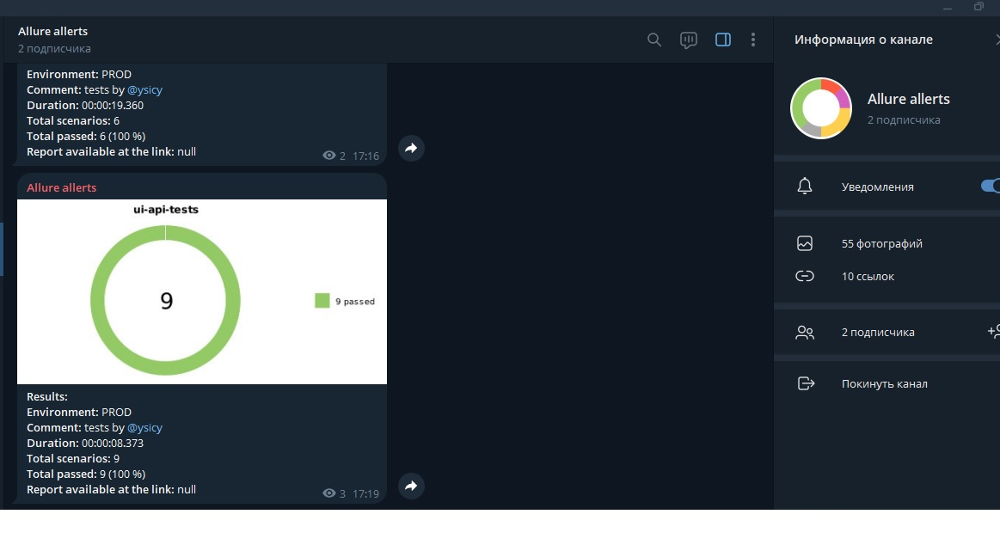

 <h1> Демонстрационный автоматизированный проект на своей инфраструктуре  </a> </h1> 

**Технологии и инструменты:**

**Особенности проекта**:
- `Page Object` шаблон проектирования
- Возможность запуска тестов: локально, удалённо, по тегам
- Использование `Lombok` для моделей в API тестах
- Так же, в API тестах для сериализации и десериализации объектов используется библиотека `Jaсkson`
- По итогу прохождения автотестов генерируется `Allure отчет`. Содержание отчета:
    - Шаги теста
    - Скриншот страницы на последнем шаге
    - Исходный код страницы в браузере
    - Логи консоли браузера
    - Видео выполнения автотеста
- По прохождению тестов формируется и отправляется уведомление о результатах прохождения в `Telegram-канал` в виде Allure отчета

# На сайте [Большая Российская Энциклопедия](https://bigenc.ru/) выполняются проверки в части WEB:

- [x] Проверка текста на странице авторизации
- [x] Проверка перехода на статическую страницу
- [x] Проверка отправки значения в строку поиска (Параметризованный тест)
- [x] Проверка ввода и поиска значения на странице Каталога (Параметризованный тест)
- [x] Проверка невозможности отправки заявки без заполнения формы Стать автором"
# На сайте [FAKESTOREAPI](https://fakestoreapi.com/) выполняются проверки в части API:

- [x] Получение списка всех пользователей
- [x] Получение определенного пользователя по id
- [x] Получение списка пользователей с заданным limit
- [x] Получение списка пользователей отсортированного по DESC
- [x] Добавление нового пользователя
- [x] Удаление пользователя
- [x] Успешная авторизация
- [x] Неуспешная Авторизация

# Запуск тестов
### Допустимые комбинации

## Для **удаленного** запуска на **собственной** машине установлен **Docker**, в котором:
- Поднят `docker-container` с `Selenoid` на порте: **4444**
- Поднят `docker-container` с `Selenoid-UI`на порте: **8080**
- Поднят `docker-container` с `Jenkins` на порте: **8081**
- В `Jenkins` заведены 2 тачки: `linux-agent` и `windows-agent`  

### Создан проект с 2 item's:

1. `linux-agent`
-  на `linux-agent` выполняется проверка тестов по тегу `api`  
- Сборка собрана на основе `groovy-script`
2. `windows-agent`
- на `windows-agent` выполняются проверки тестов по тегу `ui`  
- Сборка собрана на основе `Jankinsfile`

Для примера: выбран item для проверок UI части на `windows-agent`

Пример выполнения тестов на `Selenoid`

  

> К каждому Web UI-тесту в отчете прилагается видео.   
>  Так же, Allure отчет доступен локально:
>
> 
>

## Уведомления в Telegram с использованием бота
>
> После завершения item выполняется скрипт отправки уведомления `Allure отчета` в `Telegram`
>
>

